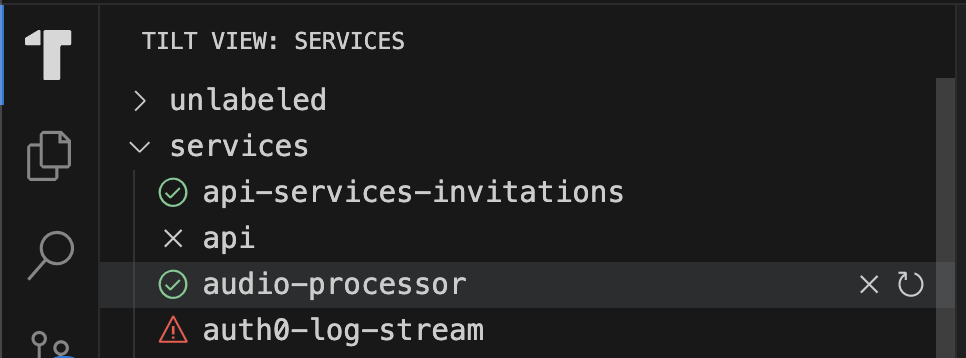

# Tilt extension for VSCode

We recently started using Tilt to manage all of the different services in our monorepo at work.
It's been a pleasure to use, but I was longing for a way to restart or disable/enable resources without switching to my browser and finding the Tilt tab.
So I spent a few days trying to "reverse engineer" their web console API to use in a VSCode extension, and this is it.

## Table of Contents

- [Tilt extension for VSCode](#tilt-extension-for-vscode)
  - [Table of Contents](#table-of-contents)
  - [Important notes](#important-notes)
  - [Features](#features)
  - [Requirements](#requirements)
  - [Extension Settings](#extension-settings)

## Important notes

This is an alpha-stage extension that is built using one very specific Tiltfile from work, which ironically doesn't even use Kubernetes.
All of the interactions with the Tilt server are debatably hacky, making use of their HTTP/WebSocket API that is **very** obviously purpose-built for **their** front end; not meant to be used outside of that purpose.
Therefore, with all of that said, this might be buggy - or even completely broken - for you.
If that's the case, I'd appreciate any reports through GitHub Issues with an easily reproducible example.

## Features

- See a list of all of your Tilt resources and their statuses, organized by their shared labels
- Restart, disable, or re-enable any resource
- View the combined log streams in the Output panel

## Requirements

- A running Tilt server

## Extension Settings

- `vscode-tilt.tiltServerHostname`: The hostname for your Tilt server. Default: `'localhost'`.
- `vscode-tilt.tiltServerPort`: The port for your Tilt server. Default: `10350`.
